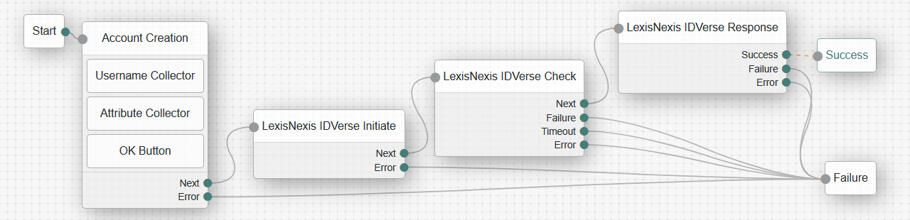

# LexisNexis IDVerse Nodes
---
LexisNexis IDVerse® is a cutting-edge document authentication and biometric verification solution that will help you confidently approve trusted transactions while detecting deepfakes and forged documents. Powered by state-of-the-art, proprietary AI models and a deep neural network, the IDVerse® solution delivers fully automated authentication of ID documents and verification of ID holdersʼ identities within seconds.

LexisNexis IDVerse is primarily integrated into the following orchestration journeys:
- New Account Origination to prevent synthetic accounts, as well as validating the account is linked to a physical person with high fidelity.
- Account Management to know who you are doing business with at every step of the journey while maintaining AML/KYC regulations
- Password Reset to validate identity prior to allowing a change.
- Login Multi-Factor Authentication (MFA) for high-risk transactions

## Installation
For the on-premise PingAM / ForgeRock, LexisNexis IDVerse Nodes are packaged as a jar file that is to be installed within the web server. To deploy the jar file, perform the following:
- Download the jar from the releases tab on github [here](https://github.com/ForgeRock/tntp-lexisnexis-IDVerse/releases/latest). 
- Stop the web container to deploy the jar file
- Copy the jar into the `../web-container/webapps/openam/WEB-INF/lib` directory where PingAM / ForgeRock is deployed
- Restart the web container to pick up the new nodes
- Once restart is complete, the nodes will then appear in the authentication trees components palette.

## Compatibility

<table>
  <colgroup>
    <col>
    <col>
  </colgroup>
  <thead>
  <tr>
    <th>Product</th>
    <th>Compatible?</th>
  </tr>
  </thead>
  <tbody>
  <tr>
    <td>
Ping Advanced Identity Cloud (PingAIC)
</td>
    <td>
Yes
</td>
  </tr>
  <tr>
    <td>
Ping Access Management (PingAM) (self-managed)
</td>
    <td>
Yes
</td>
  </tr>
  </tbody>
</table>

## Backwards Compatibility
LexisNexis IDVerse Nodes have been tested with supported PingAM / ForgeRock versions. The LexisNexis IDVerse jar file for PingAM version 7.x is backwards compatible to 7.3.0.  The LexisNexis IDVerse jar file for PingAM version 8.x is backwards compatible to 8.0.0.

## Quick Start Guide
In order to get started with the LexisNexis IDVerse Nodes, we have prepared a Quick Start Guides:
- Click [here](./docs/LNRS-IDVerse-Nodes-Getting-Started-Guide-Cloud.pdf) to download a copy of the quick start guide for PingOne AIC / ForgeRock.
- Click [here](./docs/LNRS-IDVerse-Nodes-Getting-Started-Guide-OpenAM.pdf) to download a copy of the quick start guide for PingAM / ForgeRock.

## Release Notes
To get the latest version of the LexisNexis IDVerse Nodes release notes, click [here](./docs/LNRS-IDVerse-Nodes-Release-Notes.pdf) 

# Node Overview
---
LexisNexis IDVerse Nodes provide the following:
- LexisNexis IDVerse Initiate - This node starts an IDVerse transaction
- LexisNexis IDVerse Check - This node checks the status of a transaction and performs polling until the transaction completes
- LexisNexis IDVerse Response - This node processes the final result of an IDVerse transaction

## LexisNexis IDVerse Initiate
The LexisNexis IDVerse Initiate node calls the LexisNexis Dynamic Decision Platform (DDP) Authentication Hub to initiate an IDVerse transaction. The configuration of the nodes work with the configuration of DDP Policy to invoke the IDVerse product. LexisNexis Professional Services (PS) team will configure DDP for IDVerse and assist with the development of the policy. The policy name in DDP will be configured in the node. The node parameter for Delivery Method should match how the DDP Policy is configured, mainly initiating a QR Code, Email, or SMS delivery method to the user. There is no user interface implemented by this node.

### Input
The LexisNexis IDVerse Initiate Node retrieves the following from the journey shared state based upon the configuration of the `Attribute Source` parameter.
* **AM Username (`username`)** - Required in shared state, or `objectAttributes`, to resolve the desired AM identity when the `Attribute Source = User Directory`. 
  * If Delivery Method is `Email`, then the node will fetch the configured the user's email address based on the attribute name configured for email from the AM Identity of the corresponding `username`.
  * If Delivery Method is `SMS`, then the node will fetch the configured the user's mobile phone number based on the attribute name configured for mobile phone number from the AM Identity of the corresponding `username`.
* **`objectAttributes`** - Required when the `Attribute Source = Shared State`.
  * Must at least include the following user attribute keys:
    * `mail` if using the `Email` delivery method. The attribute key is a configuration parameter, and the value `mail` is the default.
    * `mobile` if using the `SMS` delivery method.

### Configuration
The LexisNexis IDVerse Initiate Node has the following configuration parameters:
* **Org ID** - Org ID is the unique id associated to your organization on the Dynamic Decision Platform (DDP).
* **API Key** - Defines the unique security API key associated with the Org ID.
* **Base URL** - Defines the domain URL for the DDP region where API Requests are to be sent.  The default value is the global region. The URL is relative and should end with "/" character.
* **Policy** - The DDP Portal policy to be used to integrate with IDVerse. The Policy and Delivery Method together should be configured to initiate IDVerse for a specific delivery to the end-user.
* **Service Type** - Defines the API Response output fields returned from the API Request. The default configuration is Authentication Hub, which returns the IDVerse information along with core DDP output API Attributes.
* **Delivery Method** - Defines how the user will receive the initiation of an IDVerse transaction, mainly `QR Code`, `Email` or `SMS`. The Policy and Delivery Method together should be configured to initiate IDVerse for a specific delivery to the end-user.
* **Attribute Source** - This determines where the LexisNexis IDVerse Initiate node will inspect and gather user parameters to be mapped into the attributes of the IDVerse API Request. This can be configured for User Directory or for Shared State. The attribute source Shared State is typically configured in an orchestration where IDVerse is used for identity proofing for use cases such as new account origination since the user account does not exist. The attribute source User Directory is typically configured in a orchestration where IDVerse is used for identity proofing an individual as part of a login or password reset for second factor of high assurance identity.
* **User Attributes** - Attributes used to fulfill API Request to IDVerse. This includes biometric matching attributes to compare with the data extracted from the user’s government identity document if Validate Biometric Data configuration is selected. The user attributes must contain email address if Delivery Method is Email, or must contain mobile phone if Delivery Method is SMS.
* **Validate Biometric Data** - If selected, the User Attributes configuration for biometric matching attributes will be compared with the data extracted from the user’s government identity document. Valid user attributes include `account_first_name`, `account_last_name` and `account_date_of_birth`. For more information on list of valid biometric matching attributes, refer to the DDP Knowledge Base.
* **Store Initiate API Response** - If selected, the API Response from the IDVerse Initiate API to DDP will be written into shared state. This allows for subsequent nodes in the authentication tree/journey to process the information. For example, a node may read the information to write the data into an offline analysis system.

### Outputs
The LexisNexis IDVerse Initiate Node has the following outputs placed into shared state:
* **Delivery Method** - The configured delivery method will be contained in the state variable named `idverse.delivery_method`. This state variable is further used by the LexisNexis IDVerse Check Node to display a user interface while the transaction is in progress.
* **IDVerse Transaction ID** - Upon success of the LexisNexis IDVerse Initiate Node, the IDVerse Transaction ID will be contained in the state variable named `idverse.transaction_id`. This state variable is further used by the LexisNexis IDVerse Check Node and LexisNexis IDVerse Response Node to query for updated IDVerse status.
* **IDVerse QR Code URL** - Upon success of the LexisNexis IDVerse Initiate Node and if the **Delivery Method** is configured as `QR Code`, then the IDVerse QR Code URL will be contained in the state variable named `idverse.short_url`. This state variable is further used by the LexisNexis IDVerse Check Node to display the QR Code on the user interface.
* **DDP API Response** - Upon success of the LexisNexis IDVerse Initiate Node, and if the **Store Initiate API Response** configuration parameter is selected, then the DDP API Response JSON will be contained in the state variable named `idverse.ddp_api_response`.

### Callbacks
The LexisNexis IDVerse Initiate Node does not have any callbacks as there is no user interface displayed.

### Outcomes
The LexisNexis IDVerse Initiate Node has the following outcomes:
* **Next** - This outcome is triggered when the API Request returns with success to indicate the IDVerse transaction has been started. The Delivery Method and IDVerse Transaction ID are placed into Shared State, along with optionally including the API Response. The LexisNexis IDVerse Check Node uses the delivery method and transaction ID to check status and generate user interface.
* **Error** - This outcome is triggered when there is a fundamental integration error, or a new bug is discovered. First attempt to fix the integration error by looking at debug log files for the node to determine if the integration error is due to configuration. If the configuration looks accurate, then open a support case with LexisNexis Risk Solutions.

## LexisNexis IDVerse Check
This node will query the status of an IDVerse Transaction based on the **Delivery Method** and **IDVerse Transation ID** stored as state variables in shared state. This node first calls the DDP API for the status of the IDVerse transaction based on the policy defined in DDP to retrieve status. LexisNexis Professional Services (PS) team will configure DDP for IDVerse and assist with the development of the query status policy. The policy name in DDP will be configured in the node. If the check for status policy returns transaction complete, the Next outcome is triggered. Otherwise, user interface processing is invoked that checks for failure conditions (e.g. timeout or cancelled transaction) and builds the user interface if the transaction is in progress.

### Input
The LexisNexis IDVerse Check Node retrieves the following from the journey shared state that is used for processing:
* **Delivery Method** - Required in shared state. When the delivery method is `QR Code` and the user has not started the IDVerse Document Verification process, then the QR code URL contained in the input variable **IDVerse QR Code URL** will be used to build the user interface. Otherwise this state variable has no effect upon the LexisNexis IDVerse Check Node.
* **IDVerse Transaction ID** - Required in shared state. This state variable is used for the DDP API Request for the specific IDVerse Transaction to query for status.
* **IDVerse Short URL** - Required in shared state if the **Delivery Method** is configured for QR Code. This value is used to display the QR Code to the user.

### Configuration
The LexisNexis IDVerse Check Node has the following configuration parameters:
* **Org ID** - Org ID is the unique id associated your organization on the Dynamic Decision Platform (DDP).
* **API Key** - Defines the unique security API key associated with the Org ID.
* **Base URL** - Defines the domain URL for the DDP region where API Requests are to be sent.  The default value is the global region. The URL is relative and should end with "/" character.
* **Policy** - The DDP Portal policy to be used to integrate with IDVerse to retrieve status.
* **QR Code Message** - When the delivery method is `QR Code`, this configuration parameter defines the message that will be displayed with instructions to scan the QR code to begin the identity verification process. When entering the configuration, the key is the locale for the associated value text to display.
* **Polling Message** - This message is displayed while the IDVerse transaction is in progress. When entering the configuration, the key is the locale for the associated value text to display.
* **Polling Timeout (Seconds)** - The period of time (in seconds) to wait for a response to the IDVerse transaction. If no response is received during this time, the node times out and the verification process fails. The node will send a cancel transaction API Request as part of the timeout processing.
* **Polling Wait Time (Seconds)** - The period of time (in seconds) to wait between IDVerse status checks.
* **Cancel Policy** - The DDP Portal policy to be used to send a cancel transaction to IDVerse. 

### Callbacks
The LexisNexis IDVerse Check Node has the following callbacks:
* When using the `QR Code` delivery method, the node sends the following callbacks:
  * `TextTextOutputCallback` - Contains the QR Code message.
  * `ScriptTextOutputCallback` - Contains JavaScript script to run to display the QR code.
  * `PollingWaitCallback` - Waits for the user to complete the verification and contains the Waiting message.
* When using the `Email` or `SMS` delivery method, the node sends the following callbacks:
  * `PollingWaitCallback` - Waits for the user to complete the verification and contains the Waiting message.

### Output
The LexisNexis IDVerse Check Node does not have any output state variables.

### Outcomes
The LexisNexis IDVerse Check Node has the following outcomes:
* **Next** - This outcome is triggered when a completed IDVerse transaction is processed and the user successfully completed the IDVerse evaluation.
* **Failure** - This outcome is triggered when an IDVerse transaction is cancelled or fails.
* **Timeout** - This outcome is triggered when the configured timeout is exceeded and the node did not receive a response indicating the user completed the verification.
* **Error** - This outcome is triggered when there is a fundamental integration error, or a new bug is discovered. First attempt to fix the integration error by looking at debug log files for the node to determine if the integration error is due to configuration. If the configuration looks accurate, then open a support case with LexisNexis Risk Solutions.

## LexisNexis IDVerse Response
This node is to be invoked when the LexisNexis IDVerse Check Node completes. The main purpose of this node is to get the final status of the IDVerse user evaluation once the LexisNexis IDVerse Check Node indicates success of a transaction. There is no user interface.

### Input
The LexisNexis IDVerse Response Node retrieves the following from the journey shared state that is used for processing:
* **IDVerse Transaction ID** - Required in shared state. This state variable is used for the DDP API Request for the specific IDVerse Transaction to query for the final response.

### Configuration
The LexisNexis IDVerse Response Node has the following configuration parameters:
* **Org ID** - Org ID is the unique id associated your organization on the Dynamic Decision Platform (DDP).
* **API Key** - Defines the unique security API key associated with the Org ID.
* **Base URL** - Defines the domain URL for the DDP region where API Requests are to be sent.  The default value is the global region. The URL is relative and should end with "/" character.
* **Policy** - The DDP Portal policy to be used to integrate with IDVerse to get results for the completion of the transaction.
* **Service Type** - Defines the API Response output fields returned from the API Request. The default configuration is Authentication Hub, which returns the IDVerse information along with core DDP output API Attributes.
* **Store IDVerse Final Response** - If selected, the API Response from the IDVerse Get Results API to DDP will be written into shared state. This allows for subsequent nodes in the authentication tree/journey to process the information. For example, a node may read the information to write the data into an offline analysis system.

### Outputs
The LexisNexis IDVerse Response Node has the following outputs placed into shared state:
* **IDVerse API Response** - Upon success of the LexisNexis IDVerse Initiate Node, and if the **Store IDVerse Final Response** configuration parameter is selected, then the IDVerse API Response JSON will be contained in the state variable named `idverse.api_response`.
* **IDVerse Failure Reason** - If the outcome **Failure** is returned by the node, then this output state variable will contain the reason for the failure.

**Note:** This node clears shared state for the following variables used for a typical journey as these values are not required to be maintained for processing.  
- IDVerse Transaction ID contained in state variable `idverse.transaction_id`
- IDVerse Delivery Method contained in state variable `idverse.delivery_method`
- IDVerse QR Code URL contained in state variable `idverse.short_url`

### Callbacks
The LexisNexis IDVerse Response Node does not have any callbacks.

### Outcomes
The LexisNexis IDVerse Response Node has the following outcomes:
* **Success** - This outcome is triggered when the API Request results in a biometric match and the IDVerse evaluation is passing for Document Check, Document Integrity, Document Image Composition, Document Image Quality, Face Check, and Liveness.
* **Failure** - This outcome is triggered when an IDVerse transaction is cancelled or fails.
* **Error** - This outcome is triggered when there is a fundamental integration error, or a new bug is discovered. First attempt to fix the integration error by looking at debug log files for the node to determine if the integration error is due to configuration. If the configuration looks accurate, then open a support case with LexisNexis Risk Solutions.

# Configuring LexisNexis IDVerse Nodes
---
## Example Journey/Tree - Registration IDVerse

The example depicts a simple orchestration for Account Registration where Identity Verification is performed via the LexisNexis Risk Solutions IDVerse product and node integration. The workflow starts with gathering information from the user to create an account, where information is gathered via the attribute collector node and placed into shared memory. The attributes collected would be driven by customer designed user interface requirements, as well as requirements for the delivery method configured for IDVerse. LexisNexis Risk Solution recommends QR Code for delivery method. LexisNexis IDVerse nodes also provide the Biometric Matching feature which means that attributes such as user's first/last name and date of birth can be compared to the document verified in the IDVerse transaction, which is also considered a best practice. LexisNexis Risk Solutions Professional Services (PS) can advise on the best configuration settings and assist with defining the configuration for the nodes.  Once the information for account registration is gathered, then the orchestration of nodes starts with LexisNexis IDVerse Initiate to start the transaction, followed by LexisNexis IDVerse Check to poll and check for completion, followed by LexisNexis IDVerse Response when the status indicates complete.

The flow is as follows:
•	Page Node. Gathers information from the user for the purpose of showing how registration identity proofing will operate with LexisNexis IDVerse. Note that his flow is a happy path data flow to get starting using the nodes.  More complex use cases involve data mapping and data flow mapping along with IDVerse policy configuration.
•	LexisNexis IDVerse Initiate node. The configuration determines whether to pull user parameters from: (i) a user credential store, or (ii) from shared state in the journey/tree. The node then uses the information to generate an API Request and start the IDVerse transaction based on the Delivery Method configured.
•	LexisNexis IDVerse Check node. This node will query IDVerse for the current status of the transaction. If the transaction is in progress, the user interface will be generated and displayed to the user, which includes the QR Code if the user has not started the mobile phone portion of the user workflow. Once a transaction has completed, timed out, or been cancelled, the node will return the appropriate outcome.
•	LexisNexis IDVerse Response node to get the final transaction response status. The outcome will be returned that represents the status. If the outcome is failure, then the shred variable **IDVerse Failure Reason** will contain the failure reason.

